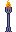
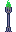
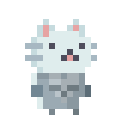
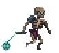

#  MyUnrealPlatformXDXD 

 

Prototipo di Platform per l'esame di **GameEngine** del [Master di computer game development dell'università di Verona](https://www.mastergamedev.it/) ed ora anche dell'esame di **High Level Programming!**

## Key feature

Porta il micio dalla torcia rossa a quella verde evitando i nemici e di schiantarti a terra (No, non è vero che i gatti se cadono dal quinto piano sopravvivono). Se premi Q muori (anche nella vita reale? Scoprilo premendo Q!!!). Ci sono 4 item che puoi raccogliere a terra e che possono cambiare le statistiche del tuo eroe!

Elemento | Descrizione
------------ | -------------
 | Personaggio controllabile dal giocatore, può saltare e muoversi, se casca da un punto troppo alto muore ::sob::
 | Nemico nel gioco, ha lo stesso comportamento dei Goomba di Super Mario, perciò uccide il giocatore se lo tocca, se sbatte su qualcosa cambia direzione e non ha paura di buttarsi in un dirupo. Può essere ucciso saltandogli in testa.
| Tile classica su cui possono muoversi i personaggi
| Weak tile, calpestabile ma attraversabile dal basso verso l'alto
| Tile che si muove da un punto all'altro nel livello
| Punto di partenza e di respawn del livello
| Punto di arrivo

# Micio stats

Nome | Descrizione | Valore Default
------------ | ------------- | -------------
Speed | Moltiplicatore in grado di alterare la velocità del micio, maggiore di 1 rende il micio più veloce, minore di 1 lo rende più lento | 1
InvincibleSeconds | Durata residua in secondi del potere dell'invincibilità, questo valore decresce col tempo fino ad arrivare a 0. | 0
AirFriction | https://9e0.itch.io/cute-legends-cat-heroes |

# Notion e Unreal <3

# Assets source

Asset | Source
------------ | -------------
Scheletro | https://astrobob.itch.io/animated-pixel-art-skeleton
Background | https://ansimuz.itch.io/mountain-dusk-parallax-background
Gatto | https://9e0.itch.io/cute-legends-cat-heroes
Tiles | https://shackhal.itch.io/multi-platformer-tileset
Torce | https://aamatniekss.itch.io/deep-forest-pixel-tileset
Items | https://iknowkingrabbit.itch.io/heroic-icon-pack

